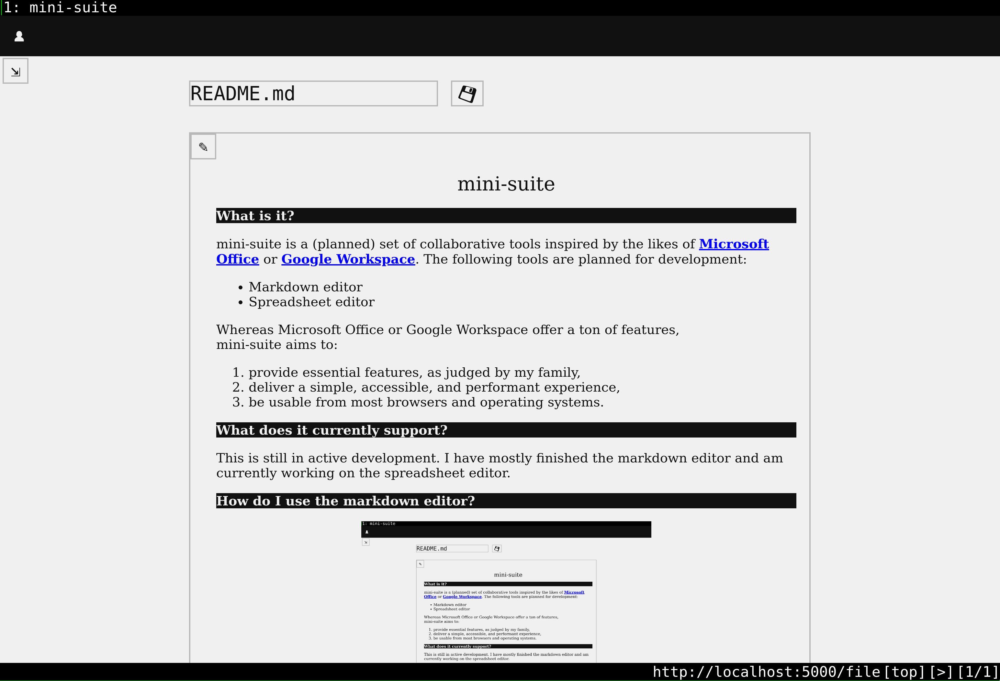

# mini-suite 

mini-suite is a set of basic productivity tools, which currently includes the following:
- Document (markdown) editor
- Spreadsheet (csv) editor

It aims to:
1. provide "essential" features,
1. deliver a simple, accessible, and performant experience,
1. be usable from most browsers and operating systems.

Note that it is not collaborative and does not have file versioning. Use `git` or a similar tool for that purpose instead.

## What can I do with the document editor?

The document editor allows you edit a markdown file.

After you [setup](#setup) your environment, you can create/edit a markdown file via `doc my_file.md`.

## What can I do with the spreadsheet editor?

The spreadsheet editor allows you to manipulate table-based data via a GUI.

It offers the following features:
1. Create a new csv file or view/edit an existing csv file,
1. Focus on a selection of cells,
1. Quickly input basic types: boolean, integers, floats, and strings,
1. Write markdown in cells,
1. Program and execute Python code in cells which can depend on other cells,
1. Cut, copy, paste, delete, insert, and move a selection of cells,
1. Erase or edit a selection of cells in bulk.

After you [setup](#setup) your environment, you can edit a csv file via `sheet my_file.csv`.

## Setup

1. Install numpy (1.26.4) and pandas (2.2.2) locally. These are dependencies of the spreadsheet editor.
1. Prepare the environment: `$ bash setup.sh`.
1. Find the path of the repository: `$ pwd`.
1. Export the path: `$ export MINISUITE_PATH=<path>`.
1. Create aliases for these tools: `$ source mini_suite.sh`.
1. Feel free to add steps 3 and 4 to your `~/.bashrc`.

You can also configure dark-mode for each tool by going to the `settings.py` in the tool's folder and setting `DARK_MODE` to `True`.

## How does this work?

Each tool runs as a web application so it can be used on any standard operating system. It uses HTML/CSS that I would expect to be compatible with most browsers.

I'm testing this with Firefox and [qutebrowser](https://www.qutebrowser.org/) on [OpenBSD 7.3](https://www.openbsd.org/73.html) and Firefox on MacOS. The tools offer key shortcuts which can be pressed with the Ctrl or Meta key. Note that because qutebrowser is modal, the key shortcuts will not work.

The server is written in [Python 3.10](https://www.python.org/downloads/release/python-3100/) using [flask](https://flask.palletsprojects.com/en/3.0.x/). The frontend has some JavaScript and communicates with the backend using [htmx](https://htmx.org/).

The markdown processor I'm using is the [Python port](https://pypi.org/project/markdown-it-py/) of [markdown-it](https://github.com/markdown-it/markdown-it).
