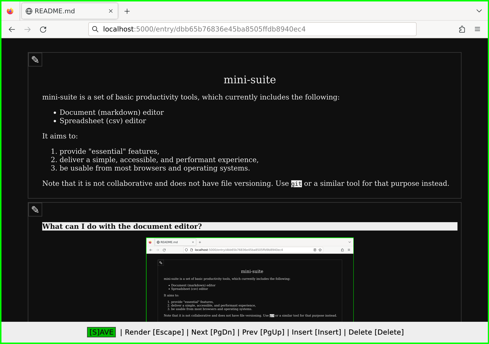

# mini-suite 

## What is it?

mini-suite is a (planned) set of collaborative tools inspired by the likes of [Microsoft Office](https://www.office.com/) or [Google Workspace](https://workspace.google.com/). The following tools are planned for development:
- Markdown editor
- Spreadsheet editor

Whereas Microsoft Office or Google Workspace offer a ton of features,
mini-suite aims to:
1. provide essential features, as judged by my family,
1. deliver a simple, accessible, and performant experience,
1. be usable from most browsers and operating systems.

## What does it currently support?

This is still in active development. I have mostly finished the markdown editor and am currently working on the spreadsheet editor.

## What can I  do with the markdown editor?

The markdown editor allows you edit markdown files. It has two modes:
1. Edit a one-off file and save changes back to the file.
1. Create a wiki of inter-linking markdown files to explore later or rendered as html.

Note that there are two key limitations of the markdown editor:
1. It has no history and may overwrite files destructively. This is intentional. The tool does not manage your file versions. Use `git` or a similar tool to do so instead.
1. It only allows you to interact with one file at a time. This is because of how the application manages state. However, if you are traversing files in the wiki, you can go back and forward using the browser's history buttons. Just remember to save your work before you do this!

After you [setup](#setup) your environment, you can edit a one-off markdown file via `doc my_file.md` and create and edit a wiki via `wiki my-wiki-dir`.

## What can I do with the spreadsheet editor?

The spreadsheet editor allows you to manipulate table-based data via a GUI.

After you [setup](#setup) your environment, you can edit a csv file via `sheet my_file.csv`.

## Setup

1. Prepare the environment: `bash setup.sh`.
2. Create aliases for the simple use-case of these tools: `source mini_suite.sh`. Add `source mini_suite.sh` to your `~/.bashrc` if you always want these aliases upon opening a new interactive shell.

## How does this work?

The tools run as a web application so that they can be usable from any operating system. It uses HTML/CSS that I would expect to be compatible with most browsers.

I'm testing this with [qutebrowser](https://www.qutebrowser.org/) on [OpenBSD 7.3](https://www.openbsd.org/73.html).

This is written mostly in [Python 3](https://www.python.org/) using [flask](https://flask.palletsprojects.com/en/3.0.x/) and [htmx](https://htmx.org/). The markdown processor I'm using is the Python port of [markdown-it](https://github.com/markdown-it/markdown-it).
